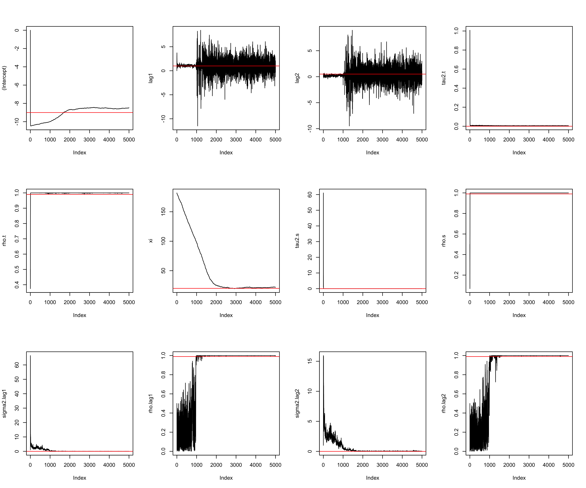
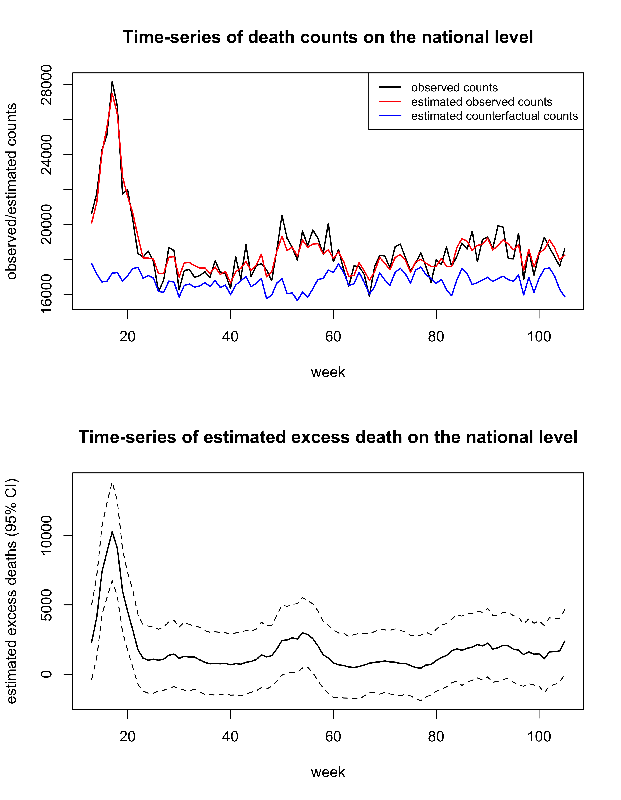
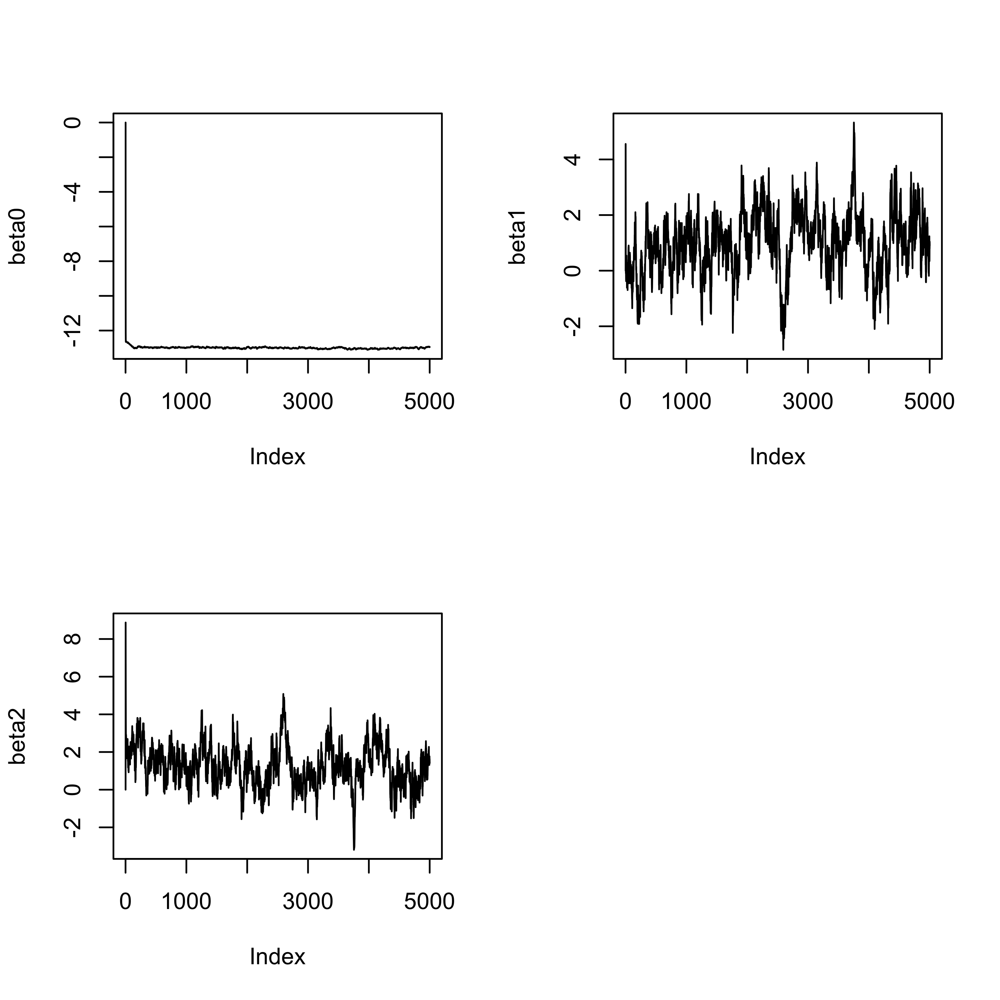
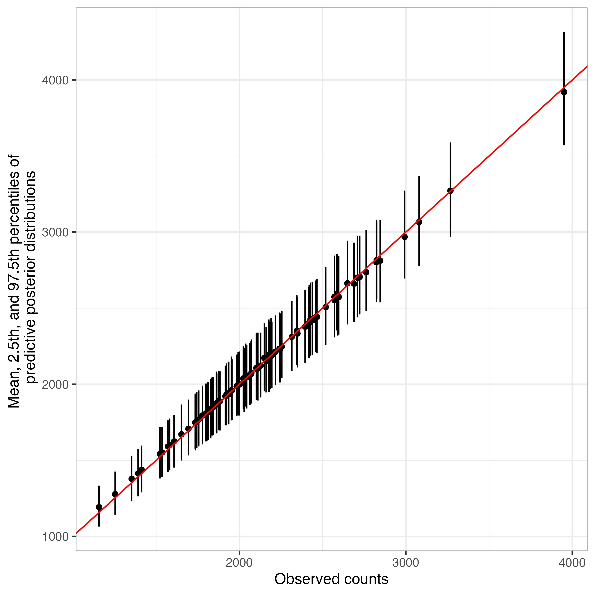
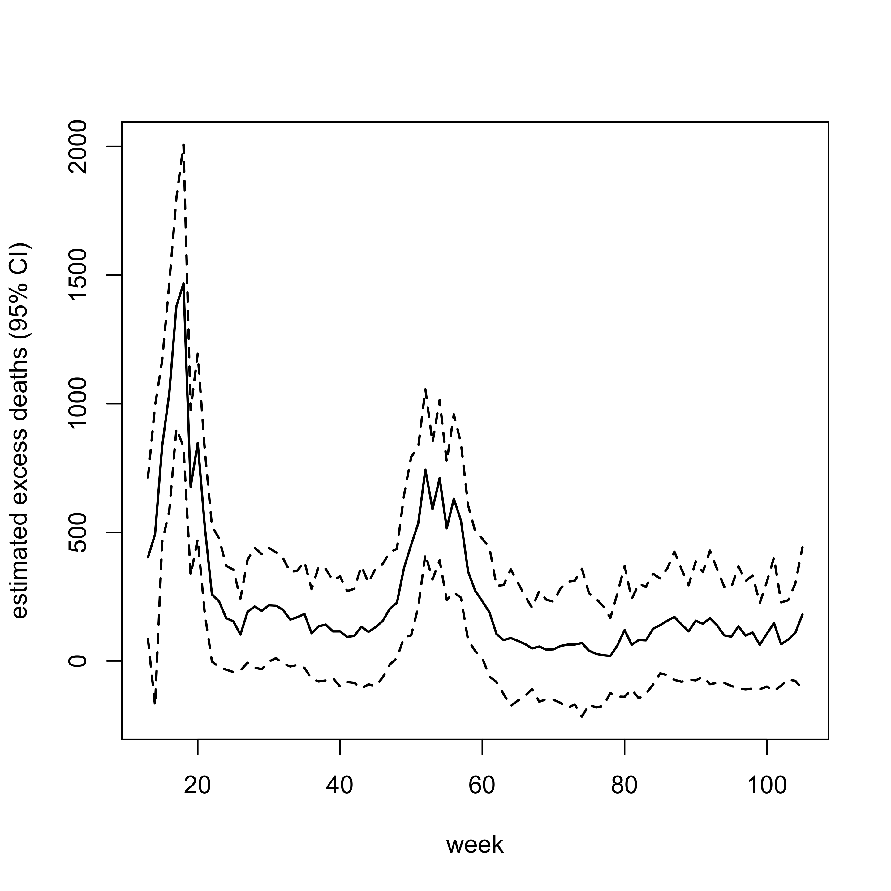

README
================

Motivated by the challenge of estimating mortality associated with
respiratory infections (e.g., influenza and COVID-19) that are not
ascertained from death certificates, we propose a Bayesian
spatial-temporal negative-binomial (NB) model with time-varying
coefficients that incorporates measures of infection activity to
estimate excess deaths. This method is implemented in an R package
`NBRegAD`. This package also implements negative-binomial regression
models to estimate excess deaths attributable to respiratory infections
with a time-series design. Since it is hard to estimate time-varying
effects based on time-series data, the function used for analyzing
time-series data only allows constant effects.

In this document, we first introduce how to install the package. Then,
we aim to demonstrate: (1) the use of the function `fit.NB.st` to
estimate excess deaths based on simulated data with space-time structure
and (2) the use of function `fit.NB.timeseries` to estimate excess
deaths based on simulated data with temporal structure. We also
illustrate the use of the function `sumcounts` to summarize estimated
mortality counts obtained from applying functions `fit.NB.st` or
`fit.NB.timeseries`.

# Installation

``` r
install.packages("devtools")
library(devtools)
install_github("YZHA-yuzi/NBRegAD")
```

# Fit the Bayesian spatial-temporal model with time-varying coefficients to estimate excess death based on simulated data

`toydata` is a simulated dataset assuming there are 51 US states and 93
epidemic weeks. Death counts `y` were generated by using estimated
percent positive obtained from the real data. The true model used to
generate death counts is space-time additive negative-binomial model, in
which week-specific random effects was generated from a random walk
model of order 1, state-specific random effects was generated from a
proper CAR model. In addition, time-varying coefficients (week-specific)
of lagged percent positive (i.e., lags 1-2) were generated by assuming a
random walk model of order 1.

Let us take a look of the simulated dataset.

``` r
library(NBRegAD)
data("toydata")
head(toydata)
```

    ##     logPop week state       lag1       lag2  y
    ## 1 8.900958   13    AK 0.03391358 0.02475891 20
    ## 2 8.900958   14    AK 0.02655453 0.03391358 11
    ## 3 8.900958   15    AK 0.02921097 0.02655453  9
    ## 4 8.900958   16    AK 0.02564867 0.02921097 21
    ## 5 8.900958   17    AK 0.01910752 0.02564867 14
    ## 6 8.900958   18    AK 0.02383704 0.01910752 19

Use the function `fit.NB.st` to fit the Bayesian spatial-temporal NB
model to estimate excess death (i.e., death counts attributable to the
infection of interest). In the fitted model, temporal and spatial random
effects were modeled using proper conditional autoregressive (CAR)
models with first-order adjacency matrices. In the function `fit.NB.st`,
we set `rand.int = TRUE` and `str.int = list("week", "AR1")` for
specifying temporal random effects, `spatial.str = list("state", "CAR")`
and `adj.mat.s = W.s` are for spatial random effects, where `W.s` is the
adjacency matrix. Time-varying coefficients for percent positive at
1-week and 2-week lags were also modeled using CAR model, which are
specified using `slope.tvarying = TRUE` and
`str.tvarying = list(c("lag1", "week", "AR1"), c("lag2", "week", "AR1"))`.
In addition, we include the log of population sizes as an offset.

``` r
## read in adjacency matrix W.s ##
data("adjmatrix_USstates")
re.st.tvarying.CAR.sim <- fit.NB.st(formula = y ~ lag1 + lag2,
                                    data = toydata,
                                    offset = logPop,
                                    niter = 5000, burn_in = 2500,
                                    rand.int = TRUE,
                                    str.int = list("week", "AR1"),
                                    slope.tvarying = TRUE, 
                                    str.tvarying = list(c("lag1", "week", "AR1"),
                                                        c("lag2", "week", "AR1")),
                                    covariate.AD = c("lag1", "lag2"),
                                    spatial.str = list("state", "CAR"), 
                                    adj.mat.s = W.s)
```

Check trace plots of parameters and hyperparameters (red lines mark true
values).

``` r
par(mfrow = c(3, 4))
parm.pl.true <- c(-9, 1, 0.5, 
                  0.01^2, 0.99, 20, 0.02^2, 0.99,
                  0.01^2, 0.99, 0.01^2, 0.99)
parm.pl.post <- cbind(re.st.tvarying.CAR.sim$beta,
                      re.st.tvarying.CAR.sim$parm,
                      re.st.tvarying.CAR.sim$parm.beta.tvarying[[1]],
                      re.st.tvarying.CAR.sim$parm.beta.tvarying[[2]])
for(i in 1:ncol(parm.pl.post)){
  plot(parm.pl.post[,i], type = "l", 
       ylab = colnames(parm.pl.post)[i])
  abline(h = parm.pl.true[i], col = "red")
}
```



Compute time-series of estimated counts, baseline counts, and excess
deaths using the function `sumcounts`. The below code produce
national-level week-specific estimates along with the 95% credible
interval of observed death counts, counterfactual counts assuming no
infections (i.e., baseline counts assuming percent positive at 1-week
and 2-week lags are zero), and excess death.

``` r
est.mat.list <- list() 
count = 1
for(i in c("pred.counts", "pred.null.counts", "AD")){
  est.mat.list[[count]] <- sumcounts(counts.post = 
                                        cbind.data.frame(
                                          toydata[,c("week", "state")], 
                                          re.st.tvarying.CAR.sim[[i]]),
                                      ID.aggre = "week",
                                      timeperiod = unique(toydata$week),
                                      locs = unique(toydata$state),
                                      ID.time = "week", ID.loc = "state")
  count = count + 1
}
names(est.mat.list) <- c("pred.counts", "pred.null.counts", "AD")
# get week-specific observed deaths counts on the national level
total.obs <- toydata %>% group_by(week) %>% summarise(y = sum(y))
```

Generate time-series plots of observed death counts, estimated observed
death counts, estimated baseline counts, and estimated excess death on
the national level.

``` r
par(mfrow = c(2,1))
plot(total.obs$week, total.obs$y, 
     ylim = c(min(est.mat.list$pred.null.counts$est),
              max(total.obs$y)),
     type = "l", lwd = 1.5, ylab = c("observed/estimated counts"),
     xlab = "week",
     main = "Time-series of death counts on the national level")
lines(total.obs$week, est.mat.list$pred.counts$est, 
      col = "red", lwd = 1.5)
lines(total.obs$week, est.mat.list$pred.null.counts$est, 
      col = "blue", lwd = 1.5)
legend("topright", legend = c("observed counts", 
                              "estimated observed counts", 
                              "estimated counterfactual counts"),
       col = c("black", "red", "blue"),
       lwd = c(1.5, 1.5, 1.5),
       lty = rep(1, 3), cex = 0.8)

plot(est.mat.list$AD$week, 
     est.mat.list$AD$est, 
     type = "l", lwd = 1.5, 
     ylab = "estimated excess deaths (95% CI)",
     xlab = "week",
     main = "Time-series of estimated excess death on the national level",
     ylim = c(min(est.mat.list$AD$lci),
              max(est.mat.list$AD$uci)))
lines(est.mat.list$AD$week, est.mat.list$AD$lci, lty = 2)
lines(est.mat.list$AD$week, est.mat.list$AD$uci, lty = 2)
```



Another example of using the function `sumcounts` to obtain estimated
excess counts in CA during the study period.

``` r
AD.CA <- sumcounts(counts.post = 
                      cbind.data.frame(toydata[,c("week", "state")], 
                                       re.st.tvarying.CAR.sim[[i]]),
                    ID.aggre = "state",
                    timeperiod = unique(toydata$week),
                    locs = "CA",
                    ID.time = "week", ID.loc = "state")
AD.CA
```

    ##   state      est       sd  lci   uci
    ## 1    CA 14063.96 6246.653 1812 26334

# Fit the NB model assuming constant effects based on time-series data to estimate excess death

Subset the simulated dataset `toydata` to creat a dataset only have
temporal structure.

``` r
dat.CA <- subset(toydata, state == "CA")
```

Fit a NB model assuming constant effects and exchangeable temporal
random effects.

``` r
fit <- fit.NB.timeseries(formula = y ~ lag1 + lag2, 
                         data = dat.CA, 
                         offset = logPop, 
                         niter = 5000, 
                         burn_in = 2500,
                         rand.int = TRUE,
                         str.int =  list("week", "exch"),
                         covariate.AD = c("lag1", "lag2"),
                         countsonly = FALSE)
```

Check trace plots of coefficients in the fitted NB model

``` r
par(mfrow = c(2, 2))
for(i in 1:3){
  plot(fit$beta[,i], type = "l", ylab = paste0("beta", i-1))
}
```



Check how the model fitted to the data

``` r
df.pl = data.frame(obs = dat.CA$y,
                   est = rowMeans(fit$pred.counts),
                   lci = apply(fit$pred.counts, 1, quantile, 0.025),
                   uci = apply(fit$pred.counts, 1, quantile, 0.975))
ggplot(data = df.pl) + 
  geom_point(aes(x = obs, y = est)) + 
  geom_errorbar(aes(x = obs, ymin = lci, ymax = uci)) + 
  geom_abline(slope = 1, intercept = 0, color = "red") +
  theme_bw() + theme(axis.title = element_text(size = 11)) + 
  labs(x = "Observed counts",
       y = paste0("Mean, 2.5th, and 97.5th", 
                  " percentiles of \n", 
                  " predictive posterior distributions"))
```

 This figure shows that
predictive posterior distributions of observed counts are scatterd
around observed values, which indicates that the model fitted to the
data well.

Plot estimated excess deaths

``` r
df.pl.AD = data.frame(week = dat.CA$week,
                      est = rowMeans(fit$AD),
                      lci = apply(fit$AD, 1, quantile, 0.025),
                      uci = apply(fit$AD, 1, quantile, 0.975))
par(mfrow = c(1, 1))
plot(df.pl.AD$week, df.pl.AD$est, type = "l", col = "black",
     ylim = c(min(df.pl.AD$lci), max(df.pl.AD$uci)), lwd = 1.5,
     ylab = "estimated excess deaths (95% CI)",
     xlab = "week")
lines(df.pl.AD$week, df.pl.AD$lci, lwd = 1.5, lty = 2)
lines(df.pl.AD$week, df.pl.AD$uci, lwd = 1.5, lty = 2)
```


